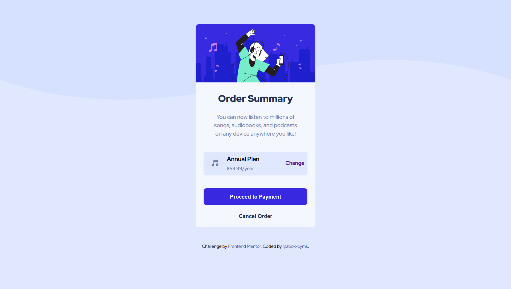

# Frontend Mentor - Order summary card solution

This is a solution to the [Order summary card challenge on Frontend Mentor](https://www.frontendmentor.io/challenges/order-summary-component-QlPmajDUj). Frontend Mentor challenges help you improve your coding skills by building realistic projects. 

## Table of contents

- [Overview](#overview)
  - [The challenge](#the-challenge)
  - [Screenshot](#screenshot)
  - [Links](#links)
- [My process](#my-process)
  - [Built with](#built-with)
  - [What I learned](#what-i-learned)
  - [Continued development](#continued-development)
  - [Useful resources](#useful-resources)
- [Author](#author)

## Overview

### The challenge

Users should be able to:

- See hover states for interactive elements

### Screenshot



### Links

- Solution URL: [order-summary-component-main](https://github.com/abok-cymk/order-summary-component-main)
- Live Site URL: [Order Summary Component Main](https://order-summary-component-nine-mu.vercel.app/)

## My process

### Built with

- Semantic HTML5 markup
- CSS custom properties
- Flexbox
- Mobile-first workflow

### What I learned
- How to change the dimensions of a background image <code>background-size: 100% 250px</code>
- `100% width 250px height`

```
body {
  background-image: url("./images/pattern-background-mobile.svg");
  background-repeat: no-repeat;
  background-size: 100% 250px;
  background-position: top center;
}
```

### Continued development
- Accessibility and Semantic will be my next stop

### Useful resources

- [W3schools](https://www.w3schools.com/css/css_rwd_mediaqueries.asp) - helped me reference media query syntax

## Author

- Frontend Mentor - [@abok-cymk](https://www.frontendmentor.io/profile/yourusername)
- Twitter - [@allanabok22](https://www.x.com/allanabok22)

